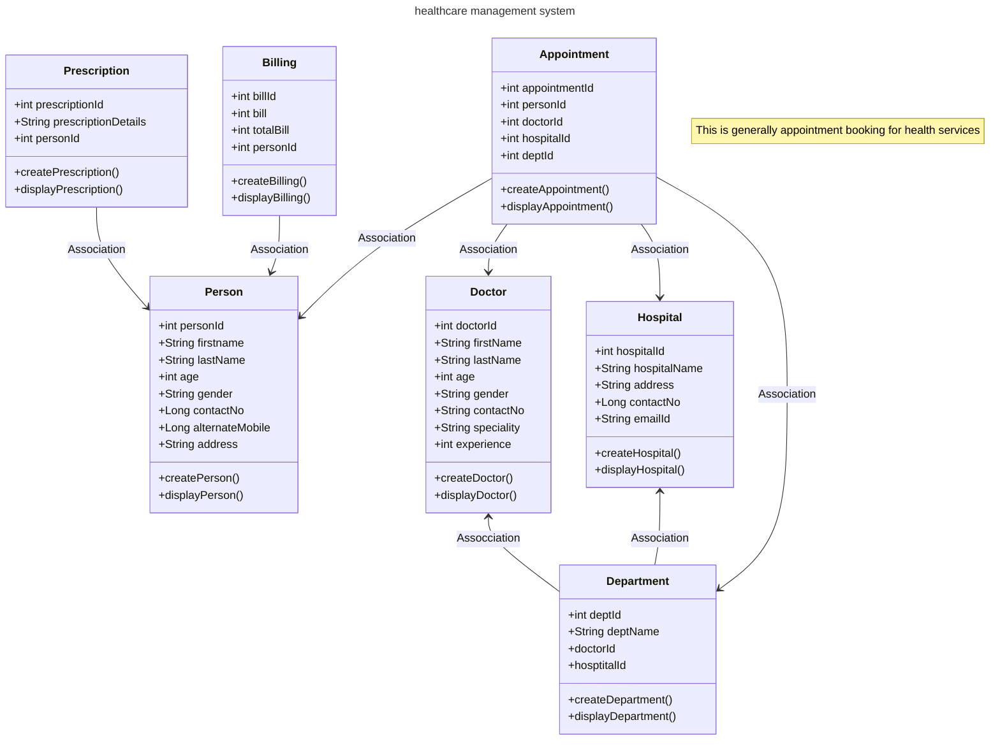

# servlet-healthcare-management-system
servlet healthcare management system

# Project Name : - healthcare-management-system.
Project Overview
The Core Java SERVLET healthcare Management Project is a basic Java application that demonstrates a Appointment booking management system. It utilizes object-oriented programming principles and simulates the interactions between persons, doctors, hospitals , and appointments.

# Features
Manage  for persons and doctors.
<ul>
  <li>Manage for persons and doctors.</li>
  <li>Simulate appointment assignment.</li>
  <li>hospitals and appointment management using Java models.</li>
  <li>Simple and intuitive structure for learning and demonstration.</li>
</ul>

# Installation and Setup
Prerequisites
<ul>
  <li>Java Development Kit (JDK) 21.</li>
  <li>An Integrated Development Environment (IDE) such as IntelliJ IDEA or Eclipse.</li>
  <li>Git (optional, for version control).</li>
</ul>

# Steps
Clone the repository:
Navigate to the project directory:
<ul>
  <li>cd servlet-healthcare-management-system</li>
  <li>Open the project in your preferred IDE.</li>
  <li>Compile and run the application:</li>
  <li>Locate Main.java.</li>
  <li>Run the file to start the application.</li>
</ul>

# POJO (Plain Old Java Objects)
<ul>
  <li>person - (persinId, fname, lname, age, gender, mobile, alternateMobile, address)</li>
  <li>doctor -(doctorId,fname,lname,age,gender,contactNo,speciality)</li>
  <li>hospital-(hopitalId,name,emailId,address,contactno)</li>
  <li>department-(deptId,deptname)</li>
  <li>appointment-(appointmentId,personId,doctorId,hospitalId)</li>
  <li>prescription-(prescriptionId,prescriptionDetails,personId)</li>
  <li>bill-(billId,bill,totalBill)</li>
</ul>

#  Class Diagram

